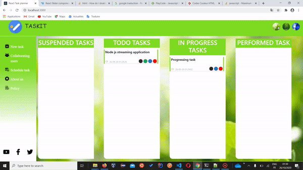

# React task planner 

## Features
* Theme change on click
* Adding new tasks with state of user' choice 
* Managing tasks states until remove
* Changing tasks states by directly dragging and dropping

## Tools
The application state is mananged using react-redux
The drag and drop performed using react brautiful dnd

### Comming 
The users managements feature will be added later

## Demo

